# Submarine-Control-System-Using-PIC-Microcontroller
## Abstract
This project focused on developing a mechatronics system for a simulated submarine, utilizing both PIC microcontroller and PLC technology. The system integrated various components, including radar and sonar systems, motor control, threat detection, and internal condition monitoring.
The objective was to evaluate the performance of PIC and PLC systems in managing the submarine's operations. The project encompassed the design and simulation of the mechatronics system, as well as the development of the necessary hardware and software components.
The findings revealed that both PIC and PLC systems effectively controlled the submarine's functions, each offering distinct strengths. The PIC system demonstrated greater flexibility and suitability for complex control algorithms, while the PLC system proved to be more reliable and robust, particularly in managing motors and mechanical components.
In conclusion, the project highlighted the capabilities of mechatronics systems in simulating and controlling advanced machines like submarines, with both PIC and PLC technologies providing valuable benefits for system design and control.

## Introduction
In this project, a mechatronics system was developed for a simulated submarine that incorporated both PIC microcontroller and PLC technology. The system included a range of components, including a radar and sonar system, motor control, a threat detection system, and internal condition monitoring.
The aim of this project was to compare the performance of the PIC and PLC systems in controlling the submarine's various components and systems. The project involved the design and simulation of the mechatronics system, including the development of the software and hardware components required for the system to function.
The results of the project indicated that both PIC and PLC systems were capable of controlling the submarine's systems effectively, with each technology offering specific advantages and disadvantages. The PIC system was found to be more flexible and capable of handling complex control algorithms, while the PLC system was more reliable and robust in controlling the submarine's motors and other mechanical systems.
Overall, the project demonstrated the potential of mechatronics systems in simulating and controlling complex machines such as submarines, with both PIC and PLC technology offering unique benefits in the design and control of such systems.

## Background Theory
Mechatronics is an interdisciplinary field that combines mechanical, electrical, and computer engineering to design and develop complex systems that incorporate multiple components and functions. Mechatronics systems are prevalent in many applications, including manufacturing, automotive, aerospace, and robotics.
The development of mechatronics systems involves the integration of sensors, actuators, microcontrollers, and other electronic components to control the mechanical systems' behavior. The design of mechatronics systems requires a comprehensive understanding of mechanical, electrical, and computer engineering principles and their interaction to create a reliable and efficient system.
In the case of the submarine mechatronics project, the integration of PIC microcontroller and PLC technology was used to control various submarine systems, including the radar and sonar system, motor control, threat detection system, and internal condition monitoring. PIC microcontrollers are commonly used in mechatronics systems for their flexibility and ability to handle complex control algorithms. On the other hand, PLC technology is known for its reliability and robustness in controlling mechanical systems.
The simulation of the submarine mechatronics system allowed for the assessment of both the PIC and PLC systems' performance in controlling the submarine systems. This project aimed to evaluate the strengths and weaknesses of both technologies in controlling the submarine systems and determine which technology is better suited for specific tasks and applications.
Submarines are underwater vehicles designed for a wide range of applications, including military, scientific, and commercial purposes. These vehicles can operate at great depths, and their design is critical in ensuring their safety and efficiency in underwater environments.
The typical design of a submarine includes a cylindrical hull that provides buoyancy and stability, with various compartments for storage, crew quarters, and equipment. The submarine's propulsion system includes electric motors, which are powered by batteries or diesel generators, and a propeller that allows the submarine to move through the water. Submarines also include various sensors, such as sonar and radar, to detect objects and hazards in the surrounding environment.
The integration of mechatronics systems in submarines can greatly enhance their capabilities and efficiency, allowing for the control and monitoring of various systems within the vehicle. The design and development of mechatronics systems for submarines require a comprehensive understanding of the vehicle's systems and the principles of mechatronics engineering.
Mechatronics systems are vital in modern technology and have a wide range of applications. The integration of PIC microcontroller and PLC technology in the submarine mechatronics project allowed for the creation of a complex and efficient system. The assessment of both technologies' performance in controlling the submarine systems will provide valuable insights into the design and development of future mechatronics systems.

## Sonar Using PIC
### Schematic

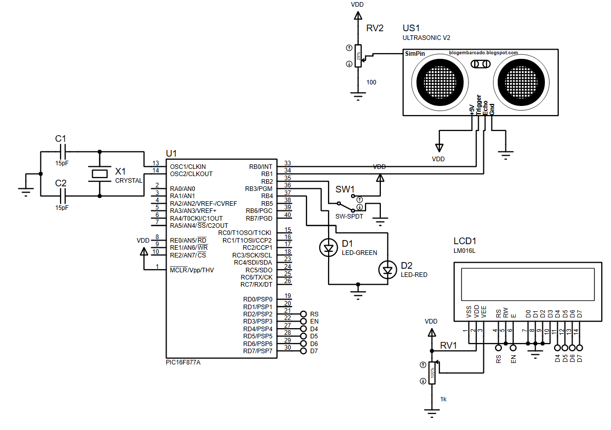

This system simulates a submarine's sonar, which detects underwater objects using sound waves that bounce off surfaces and return as echoes, providing information about location, size, and distance. It features a PIC16F877A microcontroller as the central unit, an ultrasonic sensor for object detection, an LCD display for numerical data, and a switch for power control. The ultrasonic sensor emits sound waves, calculates object distances based on the echoes, and sends data to the microcontroller, which processes and displays it. Such systems are widely used in applications like obstacle avoidance, object detection, and distance measurement.

## Code
### Header and Configuration
```c
#include <stdio.h>
#include <stdlib.h>
#include <pic16f877a.h>
#include <xc.h>
#define _XTAL_FREQ 1000000
#include "lcd.h"
```
- Includes necessary libraries for the PIC microcontroller.
- _XTAL_FREQ defines the system clock frequency (1 MHz) for delay calculations.
  
### Pin Definitions
```c
#define RS RD2
#define EN RD3
#define D4 RD4
#define D5 RD5
#define D6 RD6
#define D7 RD7
```
- These define the LCD control and data pins on PORTD.

### Initialization
```c
void main()
{
    TRISB2=1;//TURN ON OR OFF
    TRISB3=0;//GREEN LED
    TRISB4=0;//RED LED
    RB4=1;
    RB3=0;
    TRISB0=0;//TRIGGER
    TRISB1=1;//ECHO
    int a;
    TRISD=0;
    T1CON=0x10;
```
- Configures pins on PORTB and PORTD as inputs or outputs for the sonar, LEDs, and LCD.

### LCD Initialization
```c
Lcd_Init();
Lcd_Set_Cursor(1,1);
Lcd_Write_String("SONAR OFF");
```
- Initializes the LCD and displays "SONAR OFF" as the default state.

### Main Loop
- The program continuously checks the status of the sonar system (ON/OFF switch on RB2) and performs object detection when the system is active.

```c
    while(1)
    {
        if(RB2==1)
        {
              Lcd_Clear();
              Lcd_Set_Cursor(1,1);
              Lcd_Write_String("SONAR ON");
              RB3=1;
              RB4=0;
              TMR1H=0;
              TMR1L=0;
              RB0=1;
              __delay_us(10);
              RB0=0;
              TMR1ON=1;//Timer starts
              Lcd_Clear();
              while(RB1);
              TMR1ON=0;
              a=(TMR1L|(TMR1H<<8)); 
              a=a/58.82;
                Lcd_Clear();
                Lcd_Set_Cursor(2,1);
                Lcd_Write_String("Distance = ");
                Lcd_Set_Cursor(2,14);
                Lcd_Write_Char(a%10+48);
                a=a/10;
                Lcd_Set_Cursor(2,13);
                Lcd_Write_Char(a%10+48);
                a=a/10;
                Lcd_Set_Cursor(2,12);
                Lcd_Write_Char(a%10+48); 
                Lcd_Set_Cursor(2,15);
                Lcd_Write_String("cm");
                __delay_ms(500);
                Lcd_Set_Cursor(1,1);
                Lcd_Write_String("Detecting");
                __delay_ms(400);
                if(a<0.85)// <100m
                {
                    Lcd_Clear();
                    Lcd_Set_Cursor(1,1);
                    Lcd_Write_String("Object Detected");
                    __delay_ms(1000);
                }
        }   
        else if(RB2==0)
        {
            RB3=0;
            RB4=1;
            __delay_us(200);
            Lcd_Clear();
            Lcd_Set_Cursor(1,1);
            Lcd_Write_String("SONAR OFF");
            
        }
    }
}
```

- When the ON switch (RB2) is pressed:
- - The LCD displays "SONAR ON."
  - The Green LED turns on, and the Red LED turns off.
- A 10 µs pulse is sent to the sensor's Trigger pin (RB0) to start measurement.
- Timer1 counts the duration for which the Echo pin (RB1) remains HIGH, representing the time taken for the sound wave to return.
- The time value is converted into distance using the formula:
Distance (cm) = Time (µs) / 58.82
- The calculated distance is displayed on the LCD in centimeters.
- If the distance is less than 0.85 cm (or another threshold), the system detects an object and alerts the user.
- When the system is turned off:
- - The LCD displays "SONAR OFF.".
  - The Red LED turns on, and the Green LED turns off.

## Simulation Result

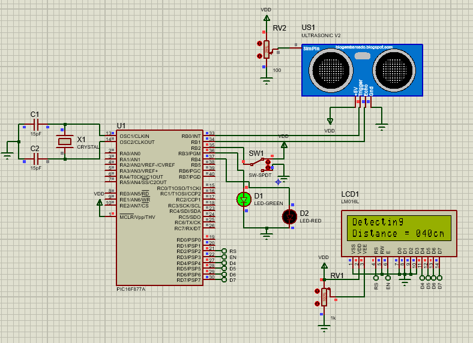

## Radar Using PIC
### Schematic

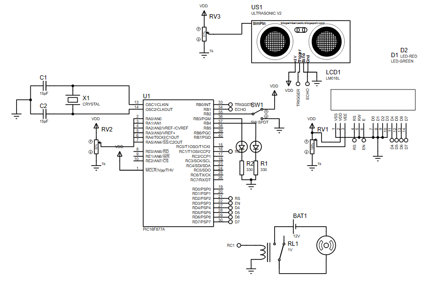

A submarine radar system uses radio waves to detect objects above the water's surface, such as vessels or aircraft, determining their location, speed, and direction. Unlike sonar, which operates underwater using sound waves, radar is crucial for navigation, intelligence gathering, and threat detection. Modern radar systems employ advanced signal processing for accurate environmental data.

The described system uses a PIC16F877A microcontroller to control an ultrasonic sensor mounted on a DC motor, enabling 360-degree object detection. A switch powers the system, and an LCD displays object location data. The ultrasonic sensor measures distance and direction by emitting sound waves that bounce off objects. The motor's rotation expands the sensor's field of view, making the system suitable for applications like surveillance and obstacle detection.

## Code
### Header Files and Configuration

```c
#include<stdio.h>
#include<stdlib.h>
#include<pic16f877a.h>
#include<xc.h>
#define _XTAL_FREQ 4000000
#include "lcd.h"
#include "adc.h"
#include "delay.h"
#include "pwm.h"
#include "stdutils.h"
```
### Pin Definitions

```c
#define RS RD2
#define EN RD3
#define D4 RD4
#define D5 RD5
#define D6 RD6
#define D7 RD7
```

### Initializzation

```c
void main()
{
    TRISA0=1;
    TRISC1=0;
    TRISB2=1;//TURN ON/OFF
    TRISB3=0;//GREEN LED
    TRISB4=0;//RED LED 
    TRISD=0;
    int a;
    TRISB0=0;//trigger
    TRISB1=1;//echo
    Lcd_Init();
    Lcd_Set_Cursor(1,1);
    Lcd_Write_String("RADAR OFF");
    RB3=0;
    RB4=1;
    RC1=0;
    T1CON=0x10;
```

### Main Loop

```c
while(1)
    {
        if(RB2==1)
        {
            RB3=1;
            RB4=0;
            TMR1H=0;
            TMR1L=0;
            RB0=1;
            __delay_us(10);
            RB0=0;
            TMR1ON=1;//Timer starts
            Lcd_Clear();
            while(RB1);
            TMR1ON=0;
            a=(TMR1L|(TMR1H<<8));
            a=a/58.82;
            RC1=1;
            if(a>=2 && a<=400)
            {
                Lcd_Set_Cursor(1,1);
                Lcd_Write_String("Distance= ");
                Lcd_Set_Cursor(1,14);
                Lcd_Write_Char(a%10+48);
                a=a/10;
                Lcd_Set_Cursor(1,13);
                Lcd_Write_Char(a%10+48);
                a=a/10;
                Lcd_Set_Cursor(1,12);
                Lcd_Write_Char(a%10+48); 
                Lcd_Set_Cursor(1,15);
                Lcd_Write_String("cm");
                __delay_ms(500);
            }
            else
            {
                Lcd_Clear();
                Lcd_Write_String(" Out of range");
                __delay_ms(400);
            }

    }
        else
        {
            RB3=0;
            RB4=1;
            Lcd_Clear();
            Lcd_Set_Cursor(1,1);
            Lcd_Write_String("System OFF");
            __delay_ms(300);
            Lcd_Clear();
        }
 }
}
```
- The system continuously checks the state of RB2 (the ON/OFF switch):
- - If RB2 == 1 (ON), the radar system activates.
  - If RB2 == 0 (OFF), the radar system is turned off.
- When the System is ON (RB2 == 1):
- - Green LED (RB3) turns ON.
  - Red LED (RB4) turns OFF.
- The trigger pin (RB0) sends a 10-microsecond pulse to the ultrasonic sensor to initiate the distance measurement process
- The echo pin (RB1) waits for the return pulse from the ultrasonic sensor.
- The timer (TMR1) starts when the pulse is sent and stops when the echo is received.
- The distance is calculated using the formula: D = Timer Value / 58.82
- The timer value (TMR1L | (TMR1H << 8)) is combined to calculate the elapsed time of the echo pulse.
- If the distance is between 2 cm and 400 cm:
-  - The distance is displayed on the LCD in centimeters.
   - Else the object is out of range.
- When the System is OFF (RB2 == 0)
- - Red LED (RB4) turns ON.
  - Green LED (RB3) turns OFF.

### Simulation Result

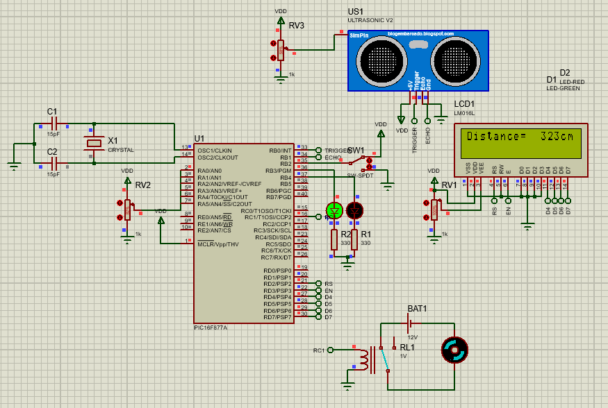

## Motion System
### Schematic

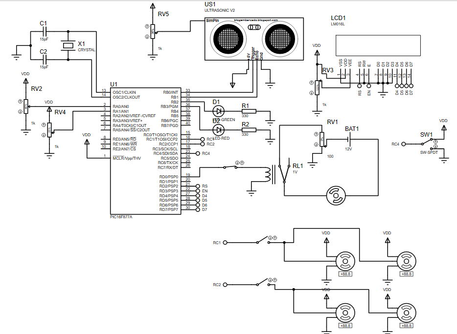

A submarine's motion system controls its movement and direction underwater, combining propulsion systems (diesel engines, electric motors, or nuclear reactors) with control surfaces like rudders, hydroplanes, and stabilizers to adjust depth, pitch, and roll. These systems are managed through a mix of manual and automated controls, supported by computers that adapt to environmental factors such as currents and temperature.

A described system utilizes a PIC16F877A microcontroller as the central control unit. It manages a DC motor for propulsion and four servo motors for controlling paddles to adjust direction and depth. An ultrasonic sensor measures the distance from the seafloor, and the microcontroller processes this data to navigate the submarine. This design is suitable for underwater exploration, surveillance, and research, emphasizing maneuverability and safety in varying conditions

### Code

### Header and Preprocessor Directives

```c
#include<stdio.h>
#include<stdlib.h>
#include<pic16f877a.h>
#include<xc.h>
#define _XTAL_FREQ 4000000
#define RS RD2
#define EN RD3
#define D4 RD4
#define D5 RD5
#define D6 RD6
#define D7 RD7
#include "lcd.h"
#include "adc.h"
#include "delay.h"
#include "pwm.h"
#include "stdutils.h"
```

### I/O Configuration

```c
    TRISB0=0; // Configure RB0 as output (Trigger for ultrasonic sensor)
    TRISB1=1; // Configure RB1 as input (Echo for ultrasonic sensor)
    TRISC1;   // Configure RC1 as input (ON/OFF switch)
    TRISB2=0; // Configure RB2 as output (Green LED)
    TRISB3=0; // Configure RB3 as output (Red LED)
    TRISD=0;  // Configure all PORTD pins as outputs (LCD configuration)
    TRISD0=0; // Configure RD0 as output (Status indicator)
    TRISA0=1; // Configure RA0 as input (ADC channel 0)
    TRISA1=1; // Configure RA1 as input (ADC channel 1)
    TRISC1=0; // Configure RC1 as output
    TRISC2=0; // Configure RC2 as output
```
- Configures the TRIS registers to set I/O directions: 0 for output, 1 for input.
- Pins are assigned for ultrasonic sensor, LEDs, LCD, ADC inputs, and control signals.

### Peripheral Initialization

```c
    PWM_Init(0);
    PWM_Init(1);
    ADC_Init();
```
- PWM_Init(0) and PWM_Init(1): Initialize PWM channels 0 and 1 for motor control.
- ADC_Init(): Initialize the ADC module to read analog input values.

### Variable declarations

```c
    long a, b, pwmValue0, pwmValue1;
    int c;
```
### Initial Setup

```c
    RD0=0; // Turn OFF status indicator
    RB2=0; // Turn OFF green LED
    RB3=1; // Turn ON red LED
    RC0=0; // Initialize RC0 as OFF
    RC4=0; // Initialize RC4 as OFF
    Lcd_Init(); // Initialize LCD
    Lcd_Set_Cursor(1,1);
    Lcd_Write_String("System is OFF");
    T1CON=0x10; // Timer1 control register (Prescaler = 1:2, Timer1 off)
```
- Initializes LEDs and status indicators.
- Sets up Timer1 for measuring ultrasonic echo response time.
- Displays "System is OFF" on the LCD.

### Boot Check

```c
    if(RC4==1)
    {
      Lcd_Clear();
      Lcd_Set_Cursor(1,1);
      Lcd_Write_String("Booting Up");
      __delay_ms(500);
      Lcd_Clear();  
    }
```
- Checks if RC4 (ON/OFF switch) is ON.
- Displays "Booting Up" message for a delay of 500 ms.

### Main Loop

```c
    while(1)
```
#### System ON Logic

```c
        if(RC4==1)
```
- If the ON/OFF switch (RC4) is ON:

#### 1. Activate LEDs and Engine:
```c
       RB2=1;   // Green LED ON
       RB3=0;   // Red LED OFF
       RD0=1;   // Status indicator ON
```

#### 2. Display Status:
```c
       Lcd_Set_Cursor(1,1);
       Lcd_Write_String("ENGINE ON");
       __delay_ms(200);
       Lcd_Clear();
```

#### 3. Read ADC Values:
```c
       a=ADC_GetAdcValue(0); // Read channel 0
       b=ADC_GetAdcValue(1); // Read channel 1
```

#### 4. Calculate PWM Duty Cycles:
```c
       pwmValue0=a*100/1023;
       pwmValue1=b*100/1023;
       PWM_SetDutyCycle(1,pwmValue0); // Set duty cycle for PWM channel 1
       PWM_SetDutyCycle(0,pwmValue1); // Set duty cycle for PWM channel 0
```

#### 5. Ultrasonic Sensor Measurement:
```c
       TMR1H=0;
       TMR1L=0;
       RB0=1;               // Send trigger pulse
       __delay_us(10);
       RB0=0;
       TMR1ON=1;            // Start Timer1
       while(RB1);          // Wait for echo response
       TMR1ON=0;            // Stop Timer1
       c=(TMR1L|(TMR1H<<8));// Calculate echo duration
       c=c/58.82;           // Convert to distance in cm
```

#### 6. Display Altitude:
```c
       Lcd_Set_Cursor(2,1);
       Lcd_Write_String("Altitude:");
       Lcd_Set_Cursor(2,12);
       Lcd_Write_Char(c%10+48); // Extract and display digits
       c=c/10;
       Lcd_Write_Char(c%10+48);
       c=c/10;
       Lcd_Write_Char(c%10+48);
       Lcd_Set_Cursor(2,15);
       Lcd_Write_String("m");
```

#### System OFF 
```c
        else if(RC4==0)
        {
            RB2=0; // Green LED OFF
            RB3=1; // Red LED ON
            RD0=0; // Status indicator OFF
            Lcd_Clear();
            Lcd_Set_Cursor(1,1);
            Lcd_Write_String("System is OFF");
        }
```
### Simulation Result

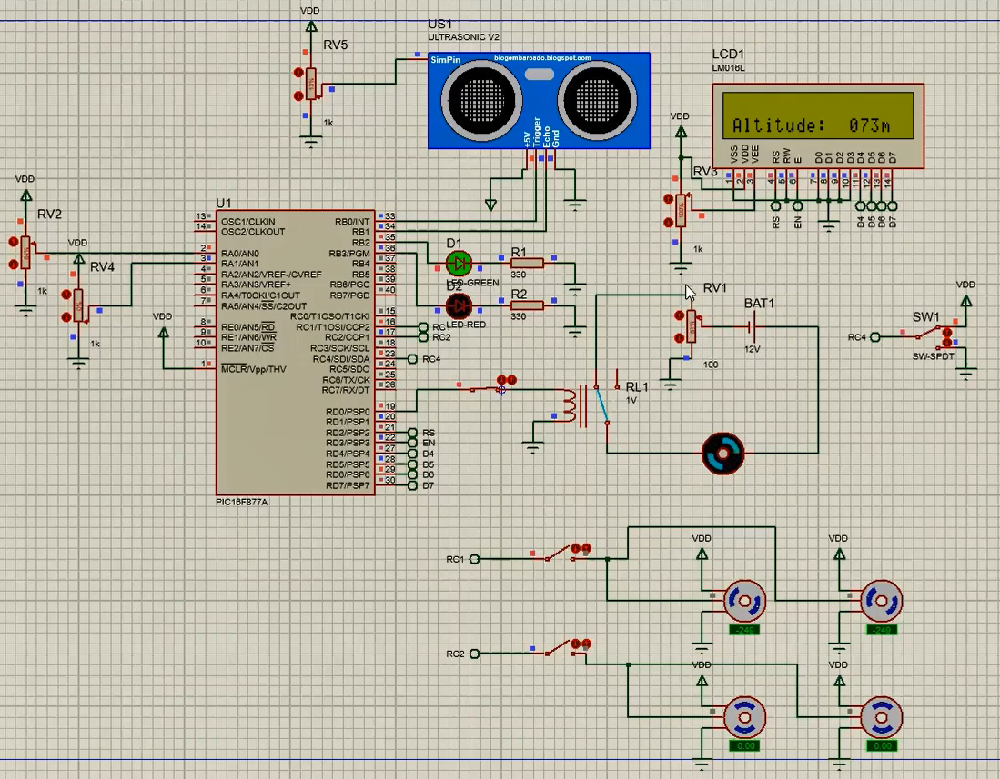

## Threat Detection System Using PIC
### Schematic

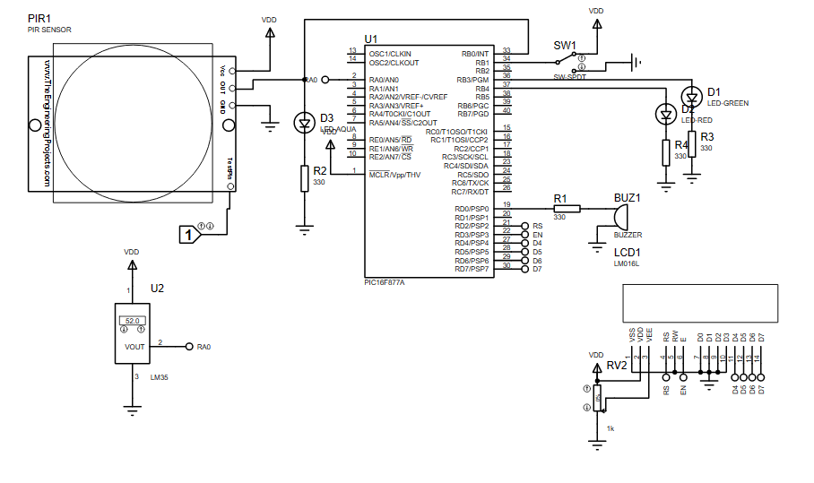

A submarine's threat detection system is essential for identifying and responding to potential dangers in its environment. It uses a combination of sensors, such as sonar, radar, periscopes, and passive listening devices, to detect vessels, aircraft, or objects. These sensors gather data, which is processed by advanced computer systems to quickly identify threats and provide actionable information to the crew. Submarines can use decoys or countermeasures to evade threats. Constant advancements ensure the system adapts to new challenges.

The schematic describes a threat detection system using a PIC16F877A microcontroller. It integrates a PIR motion sensor to detect movement and a temperature sensor to identify heat-emitting threats, such as engines or weapons. The microcontroller processes sensor data, displays outputs on an LCD, and triggers alarms like a buzzer when threats are detected. The system includes a switch for power control and is applicable in various security scenarios. Its design ensures effective detection and response to potential threats.

### Code
#### Preprocessor Directives
```c
#include<stdlib.h>
#include<stdio.h>
#include<xc.h>
#include<pic16f877a.h>
#define _XTAL_FREQ 4000000
```

#### Pin Definitions
```c
#define RS RD2
#define EN RD3
#define D4 RD4
#define D5 RD5
#define D6 RD6
#define D7 RD7
```

#### Include other libraries
```c
#include "lcd.h"
#include "adc.h"
#include "delay.h"
#include "stdutils.h"
```

#### Main Function
```c
void main()
{
    float a;
    float volt;
    char s[0];
```

#### Set Pin Directions (TRIS Register)
```c
    TRISB0=1;  // PIR input
    TRISB1=1;  // TURN ON
    TRISB2=1;  // TURN OFF
    TRISB3=0;  // GREEN LED
    TRISB4=0;  // RED LED
    TRISD=0;   // LCD CONFIGURATION
    TRISD0=0;  // BUZZER
    TRISA0=1;  // LM35 INPUT
```

#### Initialize LCD and ADC
```c
    Lcd_Init();
    ADC_Init();
```

#### Initial State Setup
```c
    RB1=0;
    RB2=0;
    RB3=0;
    RB4=1;
    Lcd_Set_Cursor(1,1);
    Lcd_Write_String("System OFF");
```

#### Main Loop
```c
    while(1)
    {
```

#### System ON Condition
```c
        if(RB1==1)
        {
            RB3=1;
            RB4=0;
            Lcd_Clear();
            a=ADC_GetAdcValue(0);
            volt=((a*5)/1023)*100;
            Lcd_Set_Cursor(2,1);
            Lcd_Write_String("Temp=");
            Lcd_Set_Cursor(2,7);
            sprintf(s,"%f",volt);
            Lcd_Write_String(s);
            __delay_ms(1000);
            Lcd_Clear();
```

#### Motion Detection and System Response
```c
            if(RB0==1)
            {
                RD0=1;
                Lcd_Set_Cursor(1,1);
                Lcd_Write_String("Motion Detected");
                __delay_ms(500);
                Lcd_Clear();
                if(volt>=50)
                {
                    __delay_ms(500);
                    Lcd_Clear();
                    Lcd_Set_Cursor(1,1);
                    Lcd_Write_String("Danger!!!");
                    __delay_ms(1000);
                    Lcd_Set_Cursor(2,1);
                    Lcd_Write_String("Turn Shield ON");
                    __delay_ms(1000);
                }
            }
```
- if(RB0==1): If the PIR motion sensor detects motion (RB0 is high).
- RD0=1: Turn on the buzzer to signal motion detection.
- Lcd_Write_String("Motion Detected"): Display "Motion Detected" on the LCD.
- if(volt>=50): If the temperature exceeds 50°C, consider it a danger condition.
- Lcd_Write_String("Danger!!!"): Display "Danger!!!" on the LCD.
- Lcd_Write_String("Turn Shield ON"): Display "Turn Shield ON" to indicate a protective action.

#### No Motion Detected
```c
            else if(RB0==0)
            {
                RD0=0;
                Lcd_Set_Cursor(1,1);
                Lcd_Write_String("No Motion");
                __delay_ms(500);
                Lcd_Clear();
            }
```
- else if(RB0==0): If no motion is detected.
- RD0=0: Turn off the buzzer.
- Lcd_Write_String("No Motion"): Display "No Motion" on the LCD.

#### System OFF Condition
```c
        if(RB1==0)
        {
            RB1=0;
            __delay_ms(2000);
            RB3=0;
            RB4=1;
            Lcd_Clear();
            Lcd_Set_Cursor(1,1);
            Lcd_Write_String("System OFF");
        }
```

#### End of Main Loop
```c
        else
        {
            RB4=1;
            RB3=0;
            Lcd_Clear();
            Lcd_Set_Cursor(1,1);
            Lcd_Write_String("SYSTEM OFF");
        }
    }
}
```

### Simulation result

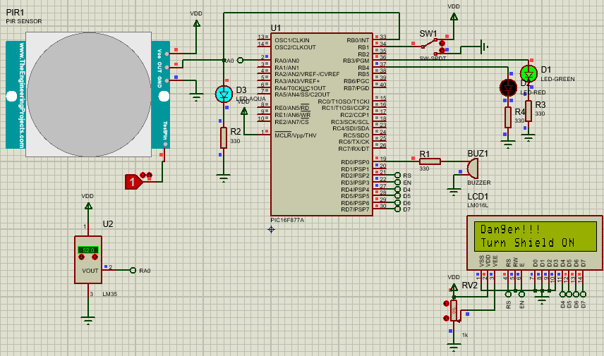

## Internal Condition Monitoring System
### Schematic

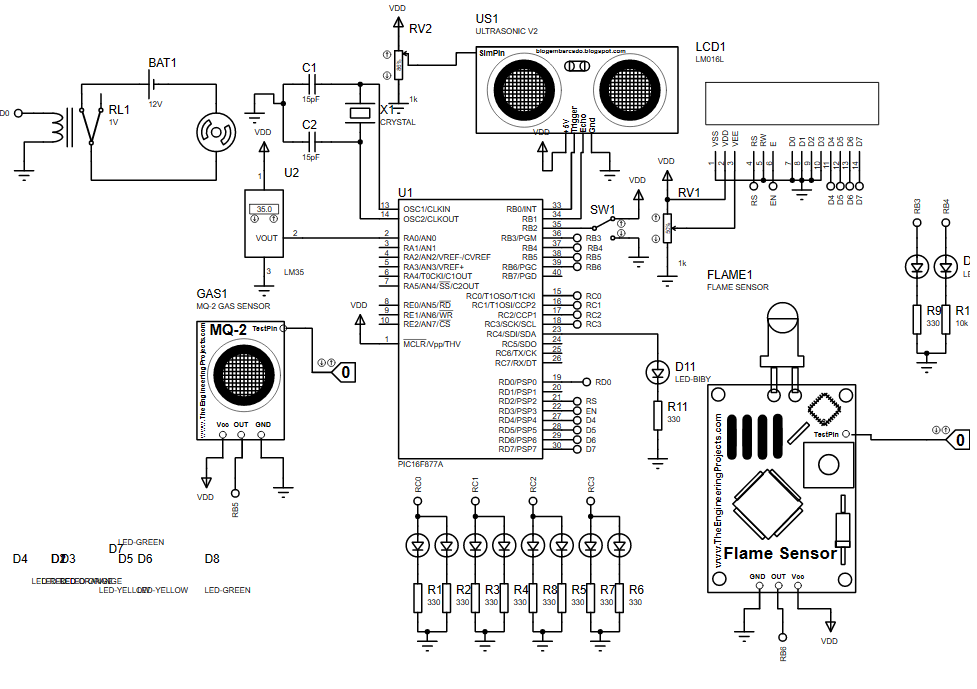

The internal systems of a submarine are complex and interconnected, combining electrical, mechanical, and hydraulic systems to ensure the safety and effectiveness of the crew. These systems include propulsion, navigation, life support, and monitoring systems for tracking parameters such as depth, temperature, and power consumption. Safety mechanisms, like emergency blow systems, are in place to quickly surface the submarine in emergencies. The crew undergoes extensive training and follows emergency protocols to operate these systems effectively. Submarine system design and maintenance are critical for safety, with rigorous testing and inspection to ensure reliability.

A schematic for a gas leakage and fire detection system using a PIC16F877A microcontroller is also discussed. This system includes sensors for gas and flame detection, a switch for system control, LED indicators for oil level, a pump for filling the tank, and an LCD for displaying system data. Such systems are vital in industrial environments to ensure safety by detecting potential hazards like gas leaks or fires, and they undergo strict testing to ensure reliability.

### Code
#### Header Files and Definitions:
```c
#include<stdio.h>
#include<stdlib.h>
#include<pic16f877a.h>
#include<xc.h>
#define _XTAL_FREQ 4000000
#include "adc.h"
#include "delay.h"
#include "lcd.h"
#include "stdutils.h"
#include "math.h"
#define RS RD2
#define EN RD3
#define D4 RD4
#define D5 RD5
#define D6 RD6
#define D7 RD7
```

#### Main Function and Initial Setup:
```c
void main()
{
    TRISA0=1;  // LM35 sensor input
    TRISA1=1;  // Gas sensor input
    TRISA2=1;  // Flame sensor input
    TRISD=0;   // LCD configuration pins as output
    RD0=0;     // Pump initially OFF
    TRISB2=1;  // Button to turn system ON/OFF
    TRISB3=0;  // Green LED output
    TRISB4=0;  // Red LED output
    TRISC0=0;
    TRISC1=0;
    TRISC2=0;
    TRISC3=0;
    TRISC4=0;  // Sprinkler output
    RC4=0;     // Sprinkler OFF
    RB3=0;     // Green LED OFF
    RB4=1;     // Red LED ON
    RD0=0;     // Pump OFF
    TRISB0=0;  // Trigger pin for ultrasonic sensor
    TRISB1=1;  // Echo pin for ultrasonic sensor
```
- TRIS registers configure the pins as input (1) or output (0).
- RD0 (Pump) is initially set OFF.
- TRISB2 is configured to control the system's ON/OFF.
- TRISB3 and TRISB4 control the LEDs (green and red).
- RC4 controls the sprinkler.
- RB0, RB1 are configured for the ultrasonic sensor (trigger and echo pins).

#### LCD Initialization
```c
    int a;
    Lcd_Init();
    Lcd_Set_Cursor(1,1);
    Lcd_Write_String("SYSTEM OFF");
    ADC_Init();  // Initialize ADC
    float b;
    int c;
    int temp;
```

#### Timer
```c
    T1CON=0x10;  // Set Timer1 to use the internal clock and configure prescaler
```

#### Main Loop:
```c
    while(1)
    {
        if(RB2==1)  // If button to turn system ON is pressed
        {
            RB3=1;   // Turn on Green LED
            RB4=0;   // Turn off Red LED
            TMR1H=0;  // Clear Timer1 high byte
            TMR1L=0;  // Clear Timer1 low byte
            RB0=1;    // Trigger ultrasonic sensor
            __delay_us(10);  // Wait for 10 microseconds
            RB0=0;    // Turn off the trigger
            TMR1ON=1; // Start Timer1
            Lcd_Clear();
            while(RB1);  // Wait until Echo pin goes low
            TMR1ON=0;  // Stop Timer1
```
- RB2 turns the system on.
- TMR1 measures time for the ultrasonic sensor (to calculate distance).
- The ultrasonic sensor sends a pulse and waits for the echo, measuring the time it takes to return.

#### Distance Calculation and Temperature Reading:
```c
            a = (TMR1L | (TMR1H << 8));  // Read Timer1 value
            a = a / 58.82;  // Convert timer value to distance in cm
            b = ADC_GetAdcValue(0);  // Get analog value from LM35 temperature sensor
            temp = ((b * 5) / 1023) * 100;  // Convert ADC value to temperature in Celsius
            c = round(temp);  // Round the temperature value
            c = c - 1;  // Subtract 1 to adjust the value
```
- a holds the measured distance based on the ultrasonic sensor's time.
- b is the temperature reading from the LM35 sensor.
- temp converts the ADC value to a temperature in Celsius.

#### Display Temperature on LCD:
```c
            Lcd_Clear();
            Lcd_Set_Cursor(1,1);
            Lcd_Write_String("Temp= ");
            Lcd_Set_Cursor(1,8);
            Lcd_Write_Char(temp % 10 + 48);  // Display tens digit of temperature
            temp = temp / 10;
            Lcd_Set_Cursor(1,7);
            Lcd_Write_Char(temp % 10 + 48);  // Display ones digit of temperature
            temp = temp / 10;
            Lcd_Set_Cursor(1,10);
            Lcd_Write_String("C");
            __delay_ms(300);
```

#### Actuate Pump Based on Distance: 
```c
            if(a > 400)  // Distance too far
            {
                RC0 = 1; RC1 = 1; RC2 = 1; RC3 = 1;  // Turn on all actuators
                RD0 = 0;  // Turn off the pump
                __delay_us(300);
                Lcd_Clear();
            }
            if(a > 300 && a < 400)  // Medium distance
            {
                RC0 = 1; RC1 = 1; RC2 = 1; RC3 = 0;  // Activate specific actuators
                __delay_us(300);
            }
            if(a > 200 && a < 300)  // Close distance
            {
                RC0 = 1; RC1 = 1; RC2 = 0; RC3 = 0;  // Activate fewer actuators
                __delay_us(300);
            }
            if(a < 100)  // Too close
            {
                RC0 = 1; RC1 = 0; RC2 = 0; RC3 = 0;  // Activate the pump
                RD0 = 1;
                Lcd_Set_Cursor(2,1);
                Lcd_Write_String("Pump is ON");
                __delay_us(300);
            }
```
#### Gas Leakage and Fire Detection
```c
            if(RB5 == 1)  // If gas sensor detects leakage
            {
                Lcd_Set_Cursor(2,1);
                Lcd_Write_String("GAS LEACKAGE");
                __delay_ms(500);
            }
            if(RB6 == 1)  // If flame sensor detects fire
            {
                Lcd_Set_Cursor(2,1);
                Lcd_Write_String("Fire is Detected");
                RC4 = 1;  // Activate sprinkler
                __delay_ms(500);
            }
            if(RB6 == 0)  // Fire detected condition is cleared
            {
                RC4 = 0;  // Deactivate sprinkler
            }
        }
        else  // If system is off
        {
            Lcd_Clear();
            Lcd_Set_Cursor(1,1);
            Lcd_Write_String("SYSTEM OFF");
            RB3 = 0;  // Turn off Green LED
            RB4 = 1;  // Turn on Red LED
            RD0 = 0;  // Turn off pump
        }
    }
}
```
- RB5 checks for gas leakage and shows a message.
- RB6 checks for fire and triggers a sprinkler (RC4).
- If the system is off (RB2 not pressed), the LCD displays "SYSTEM OFF," and the pump and LEDs are turned off.

### Simulation Result

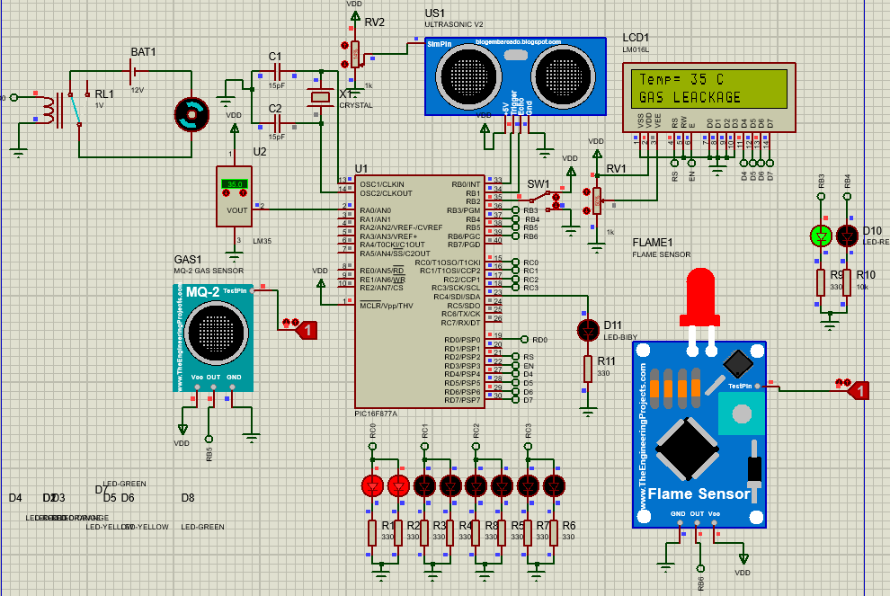

## Submarine System Using PLC
### Ladder Diagram Code

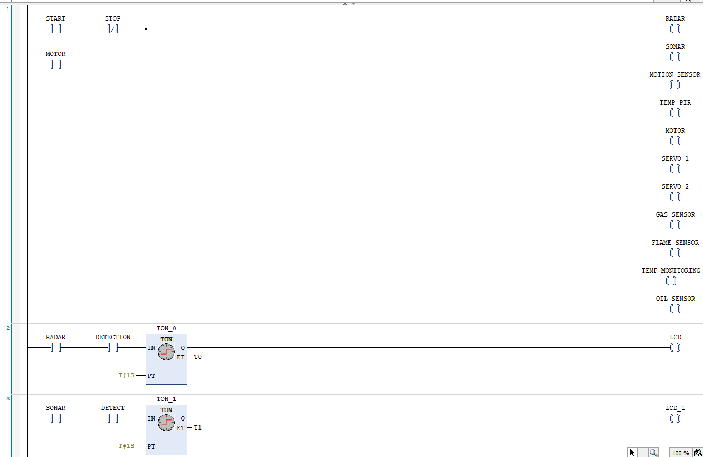
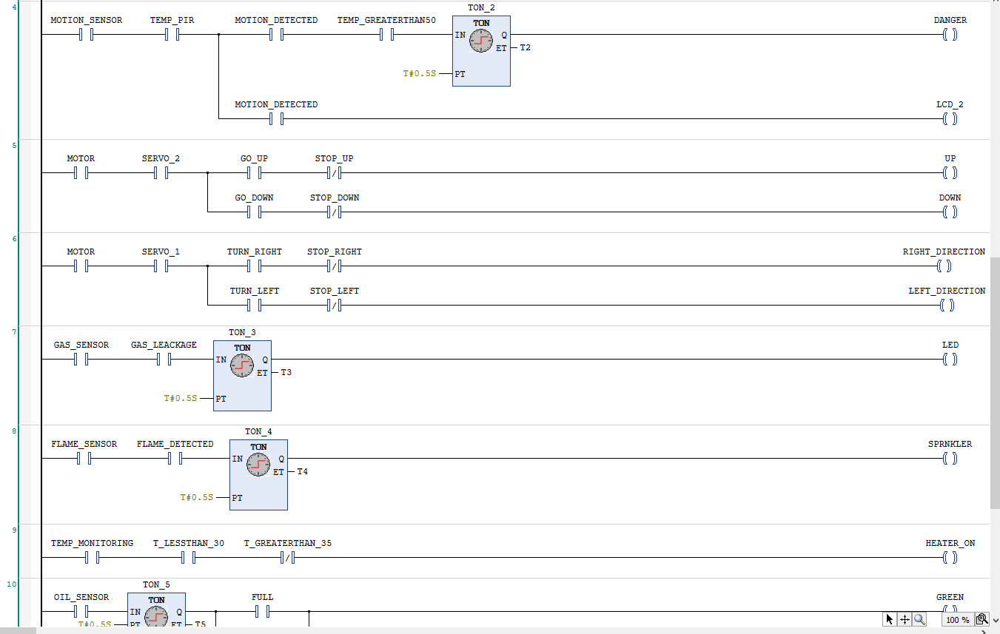
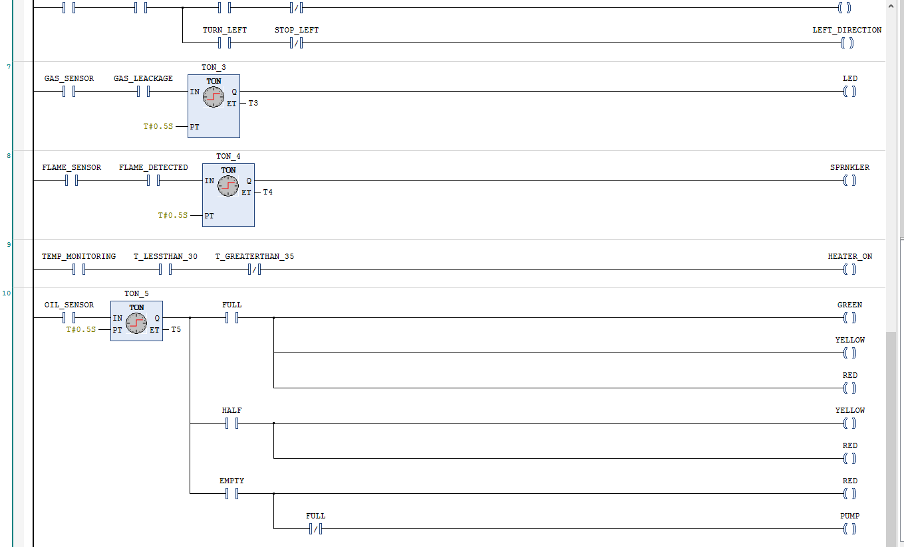

PLC (Programmable Logic Controller) ladder diagrams are graphical programming languages that allow the user to program the operation of industrial control systems. In the case of a submarine system, the user can create a ladder diagram that performs the same functions as the previously described schematic. The user can use ladder diagrams to create a system that controls the main motor, servo motors, ultrasonic sensor, and other components of the submarine. The ladder diagram can also incorporate safety features such as emergency blow systems, fire suppression systems, and gas sensors to ensure the safety of the crew. The PLC ladder diagram provides an effective means of programming and controlling complex industrial systems, including submarines, and ensures the reliable and safe operation of these systems.

### Simulation Result


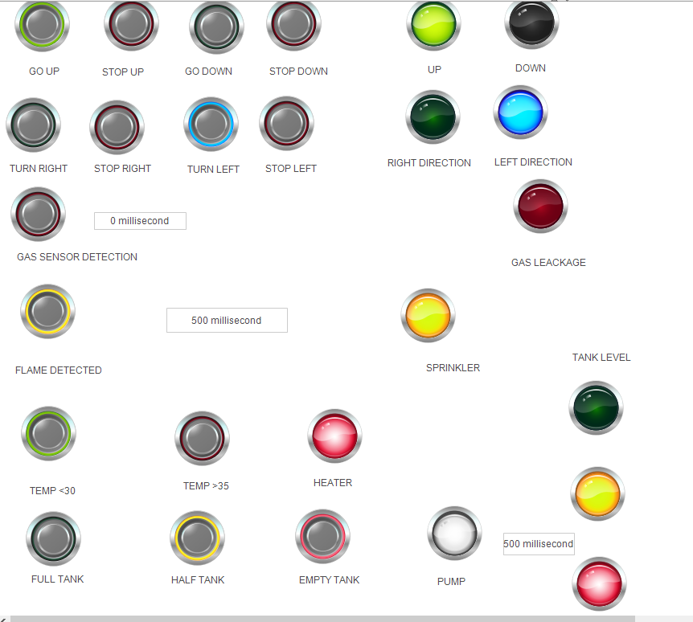

## Conclusion
In conclusion, the design and development of a submarine control system is a complex and critical process that requires careful consideration of various factors, including safety, reliability, and efficiency. Both the PIC microcontroller and PLC ladder diagrams offer viable options for controlling the different subsystems of the submarine. While the PIC microcontroller is more suited for smaller-scale applications, PLC ladder diagrams are designed to handle larger, more complex systems. Additionally, PLCs are specifically designed for industrial control applications, including submarines, and can handle a higher volume of I/O points than PIC microcontrollers. However, PIC microcontrollers are more flexible and can be programmed to perform a wider range of tasks. Ultimately, the choice between PIC and PLC depends on the specific needs and requirements of the submarine control system. A thorough understanding of both options and their respective advantages and disadvantages can help in selecting the most suitable option for a particular project as with any technological project, there are always opportunities for future tasks and updates. For the submarine control system, some potential future tasks and updates include integrating new sensors or components, improving the efficiency of the system, and incorporating more advanced safety features. For instance, incorporating more advanced artificial intelligence systems or machine learning algorithms can enable the system to learn and adapt to the submarine's environment and respond more intelligently to emergencies. Additionally, integrating remote monitoring capabilities can allow for real-time monitoring of the submarine's status and enable remote control and troubleshooting. Future updates to the system may also involve improving the user interface to enhance ease of use and readability. Ultimately, the potential future tasks and updates will depend on the specific needs and requirements of the submarine control system and its users. It is important to note that the simulations and components used in this technical research project are intended solely to mimic those of a submarine and are not intended for actual use in a submarine or any other industrial or commercial application. These simulations and components are designed to test the functionality and performance of the submarine control system in a controlled environment and do not reflect the actual conditions and constraints of a real-world submarine. Therefore, any conclusions drawn from this technical research should be considered in the context of this simulated environment and should not be extrapolated to other applications or environments without further testing and validation.


​

